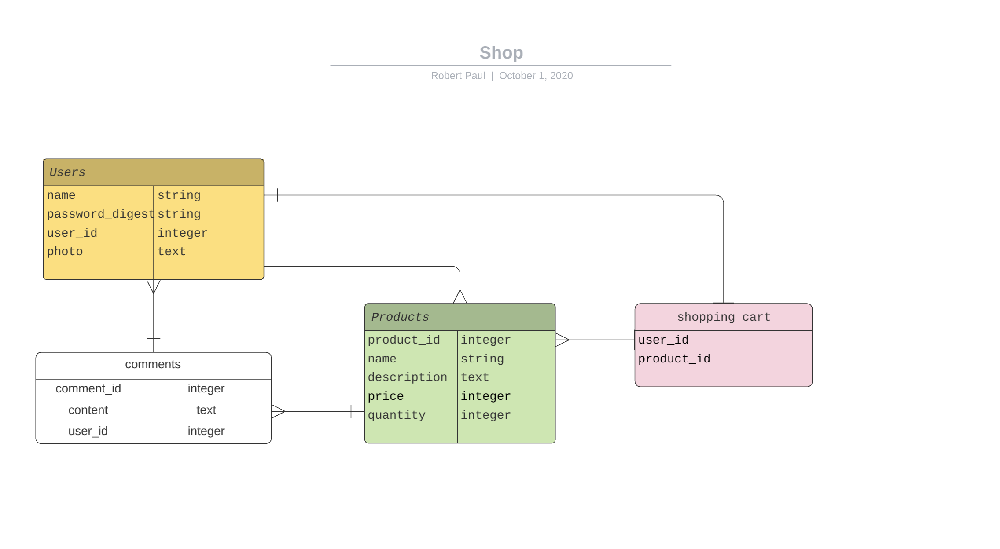

# WeShop Node/Express server API
Final project backend at General Assembly Software Engineering Immersive. 

This is a server running on Node.js and Express, which provides JSON to display products on a React frontend.

### Features
- Database for user and product data uses Mongoose schemas to create associations
- Login route which uses JWT (JSON web tokens) for authenticating user login
- Server accesses remote cloud instance of MongoDB stored in MongoDB Atlas

### Technologies
- Node.js
- Express
- Mongoose/MongoDB & MongoDB Atlas
- JWT for authentication
- Bcrypt for hashing user passwords 
- Heroku

### Set up 

To start the server locally, simply run `npm start`. 

### Planning stage

### Future dev plans
- Additional routes including order route to allow storing users' carts as an order
- Addition of product categories in MongoDB database

